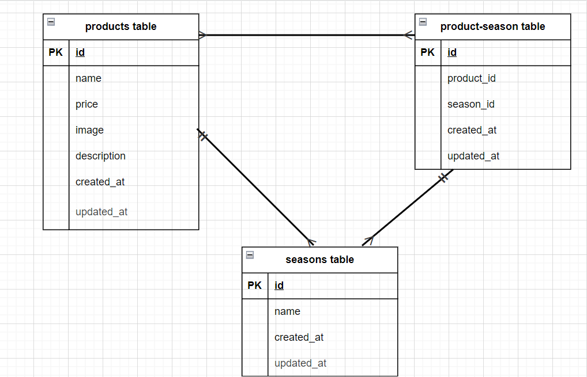

# アプリケーション名
- fruit-test2

## 環境構築
docker-compose up -d --build
code .
docker-compose exec php bash
composer install
root@c8ec58bb1a53:/var/www# cp .env.example .env
root@c8ec58bb1a53:/var/www# exit
exit
aoi@DESKTOP-GRA4G3D:~/coachtech/laravel/fruit-test2$ cd src
aoi@DESKTOP-GRA4G3D:~/coachtech/laravel/fruit-test2/src$ ls -l
total 352
-rw-r--r--  1 aoi  aoi    3958 Jun  2 11:44 README.md
drwxr-xr-x  7 aoi  aoi    4096 Jun  2 11:44 app
-rwxr-xr-x  1 aoi  aoi    1686 Jun  2 11:44 artisan
drwxr-xr-x  3 aoi  aoi    4096 Jun  2 11:44 bootstrap
-rw-r--r--  1 aoi  aoi    1745 Jun  2 11:44 composer.json
-rw-r--r--  1 aoi  aoi  290333 Jun  2 11:44 composer.lock
drwxr-xr-x  2 aoi  aoi    4096 Jun  2 11:44 config
drwxr-xr-x  5 aoi  aoi    4096 Jun  2 11:44 database
-rw-r--r--  1 aoi  aoi     473 Jun  2 11:44 package.json
-rw-r--r--  1 aoi  aoi    1202 Jun  2 11:44 phpunit.xml
drwxr-xr-x  2 aoi  aoi    4096 Jun  2 11:44 public
drwxr-xr-x  6 aoi  aoi    4096 Jun  2 11:44 resources
drwxr-xr-x  2 aoi  aoi    4096 Jun  2 11:44 routes
-rw-r--r--  1 aoi  aoi     569 Jun  2 11:44 server.php
drwxr-xr-x  5 aoi  aoi    4096 Jun  2 11:44 storage
drwxr-xr-x  4 aoi  aoi    4096 Jun  2 11:44 tests
drwxr-xr-x 44 root root   4096 Jun  2 11:49 vendor
-rw-r--r--  1 aoi  aoi     559 Jun  2 11:44 webpack.mix.js
aoi@DESKTOP-GRA4G3D:~/coachtech/laravel/fruit-test2/src$ sudo chmod -R u+w /home/aoi/coachtech/laravel/fruit-test2/src
[sudo] password for aoi:
aoi@DESKTOP-GRA4G3D:~/coachtech/laravel/fruit-test2/src$ sudo chown -R aoi:aoi /home/aoi/coachtech/laravel/fruit-test2
aoi@DESKTOP-GRA4G3D:~/coachtech/laravel/fruit-test2/src$ cd resources
aoi@DESKTOP-GRA4G3D:~/coachtech/laravel/fruit-test2/src/resources$ cd views
aoi@DESKTOP-GRA4G3D:~/coachtech/laravel/fruit-test2/src/resources/views$ touch index.blade.php
aoi@DESKTOP-GRA4G3D:~/coachtech/laravel/fruit-test2/src/resources/views$ touch confirm.blade.php
aoi@DESKTOP-GRA4G3D:~/coachtech/laravel/fruit-test2/src/resources/views$ touch thanks.blade.php
aoi@DESKTOP-GRA4G3D:~/coachtech/laravel/fruit-test2/src/resources/views$ cd ../../
aoi@DESKTOP-GRA4G3D:~/coachtech/laravel/fruit-test2/src$ cd public
aoi@DESKTOP-GRA4G3D:~/coachtech/laravel/fruit-test2/src/public$ mkdir css
aoi@DESKTOP-GRA4G3D:~/coachtech/laravel/fruit-test2/src/public$ cd css
aoi@DESKTOP-GRA4G3D:~/coachtech/laravel/fruit-test2/src/public/css$ touch index.css
aoi@DESKTOP-GRA4G3D:~/coachtech/laravel/fruit-test2/src/public/css$ touch confirm.css
aoi@DESKTOP-GRA4G3D:~/coachtech/laravel/fruit-test2/src/public/css$ touch thanks.css
aoi@DESKTOP-GRA4G3D:~/coachtech/laravel/fruit-test2/src/public/css$ touch sanitize.css
aoi@DESKTOP-GRA4G3D:~/coachtech/laravel/fruit-test2/src/public/css$ cd ,,.,,.
-bash: cd: ,,.,,.: No such file or directory
aoi@DESKTOP-GRA4G3D:~/coachtech/laravel/fruit-test2/src/public/css$ cd ../../
aoi@DESKTOP-GRA4G3D:~/coachtech/laravel/fruit-test2/src$ cd ../
aoi@DESKTOP-GRA4G3D:~/coachtech/laravel/fruit-test2$ $ docker-compose run php bash
$: command not found
aoi@DESKTOP-GRA4G3D:~/coachtech/laravel/fruit-test2$ docker-compose run php bash
WARN[0000] /home/aoi/coachtech/laravel/fruit-test2/docker-compose.yml: the attribute `version` is obsolete, it will be ignored, please remove it to avoid potential confusion
root@750a83e24adc:/var/www# php artisan make:controller ProductController
Controller created successfully.
root@750a83e24adc:/var/www# exit
exit
aoi@DESKTOP-GRA4G3D:~/coachtech/laravel/fruit-test2$ cd src/app/Http/Controllers
aoi@DESKTOP-GRA4G3D:~/coachtech/laravel/fruit-test2/src/app/Http/Controllers$ ls -l
total 8
-rw-r--r-- 1 aoi  aoi  361 Jun  2 11:44 Controller.php
-rw-r--r-- 1 root root 124 Jun  2 12:07 ProductController.php
aoi@DESKTOP-GRA4G3D:~/coachtech/laravel/fruit-test2/src/app/Http/Controllers$ sudo chmod -R u+w /home/aoi/coachtech/laravel/fruit-test2/src
[sudo] password for aoi:
aoi@DESKTOP-GRA4G3D:~/coachtech/laravel/fruit-test2/src/app/Http/Controllers$ sudo chown -R aoi:aoi /home/aoi/coachtech/laravel/fruit-test2
aoi@DESKTOP-GRA4G3D:~/coachtech/laravel/fruit-test2/src/app/Http/Controllers$ cd ../../../../
aoi@DESKTOP-GRA4G3D:~/coachtech/laravel/fruit-test2$ docker-compose run php bash
WARN[0000] /home/aoi/coachtech/laravel/fruit-test2/docker-compose.yml: the attribute `version` is obsolete, it will be ignored, please remove it to avoid potential confusion
WARN[0000] Found orphan containers ([fruit-test2-php-run-bc35b0e04cd0]) for this project. If you removed or renamed this service in your compose file, you can run this command with the --remove-orphans flag to clean it up.
root@3c1227245597:/var/www# php artisan key:generate
Application key set successfully.
root@3c1227245597:/var/www# sudo chmod -R 777 *
bash: sudo: command not found
root@3c1227245597:/var/www# exit
exit
aoi@DESKTOP-GRA4G3D:~/coachtech/laravel/fruit-test2$ sudo chmod -R 777 *
aoi@DESKTOP-GRA4G3D:~/coachtech/laravel/fruit-test2$ docker-compose run php bash
WARN[0000] /home/aoi/coachtech/laravel/fruit-test2/docker-compose.yml: the attribute `version` is obsolete, it will be ignored, please remove it to avoid potential confusion
WARN[0000] Found orphan containers ([fruit-test2-php-run-cdc5850bd092 fruit-test2-php-run-bc35b0e04cd0]) for this project. If you removed or renamed this service in your compose file, you can run this command with the --remove-orphans flag to clean it up.
root@14f354860205:/var/www# php artisan key:generate
Application key set successfully.
root@14f354860205:/var/www# php artisan key:generate
Application key set successfully.
root@14f354860205:/var/www# php artisan make:migration create_products_table
Created Migration: 2025_06_02_143655_create_products_table
root@14f354860205:/var/www# exit
exit
aoi@DESKTOP-GRA4G3D:~/coachtech/laravel/fruit-test2$ cd src/database/migrations
aoi@DESKTOP-GRA4G3D:~/coachtech/laravel/fruit-test2/src/database/migrations$ ls -l
total 20
-rwxrwxrwx 1 aoi  aoi  798 Jun  2 11:44 2014_10_12_000000_create_users_table.php
-rwxrwxrwx 1 aoi  aoi  683 Jun  2 11:44 2014_10_12_100000_create_password_resets_table.php
-rwxrwxrwx 1 aoi  aoi  820 Jun  2 11:44 2019_08_19_000000_create_failed_jobs_table.php
-rwxrwxrwx 1 aoi  aoi  861 Jun  2 11:44 2019_12_14_000001_create_personal_access_tokens_table.php
-rw-r--r-- 1 root root 583 Jun  2 14:36 2025_06_02_143655_create_products_table.php
aoi@DESKTOP-GRA4G3D:~/coachtech/laravel/fruit-test2/src/database/migrations$ sudo chmod -R u+w /home/aoi/coachtech/laravel/fruit-test2/src
[sudo] password for aoi:
aoi@DESKTOP-GRA4G3D:~/coachtech/laravel/fruit-test2/src/database/migrations$ sudo chown -R aoi:aoi /home/aoi/coachtech/laravel/fruit-test2
aoi@DESKTOP-GRA4G3D:~/coachtech/laravel/fruit-test2/src/database/migrations$ php artisan migrate
Could not open input file: artisan
aoi@DESKTOP-GRA4G3D:~/coachtech/laravel/fruit-test2/src/database/migrations$ cd ../../../
aoi@DESKTOP-GRA4G3D:~/coachtech/laravel/fruit-test2$ docker-compose run php bash
WARN[0000] /home/aoi/coachtech/laravel/fruit-test2/docker-compose.yml: the attribute `version` is obsolete, it will be ignored, please remove it to avoid potential confusion
WARN[0000] Found orphan containers ([fruit-test2-php-run-0520f97c874b fruit-test2-php-run-cdc5850bd092 fruit-test2-php-run-bc35b0e04cd0]) for this project. If you removed or renamed this service in your compose file, you can run this command with the --remove-orphans flag to clean it up.
root@b72694e354d9:/var/www# php artisan migrate
Migration table created successfully.
Migrating: 2014_10_12_000000_create_users_table
Migrated:  2014_10_12_000000_create_users_table (133.09ms)
Migrating: 2014_10_12_100000_create_password_resets_table
Migrated:  2014_10_12_100000_create_password_resets_table (100.10ms)
Migrating: 2019_08_19_000000_create_failed_jobs_table
Migrated:  2019_08_19_000000_create_failed_jobs_table (99.25ms)
Migrating: 2019_12_14_000001_create_personal_access_tokens_table
Migrated:  2019_12_14_000001_create_personal_access_tokens_table (141.29ms)
Migrating: 2025_06_02_143655_create_products_table
Migrated:  2025_06_02_143655_create_products_table (52.77ms)
root@b72694e354d9:/var/www# php artisan make:model Product
Model created successfully.
root@b72694e354d9:/var/www# exit
exit
aoi@DESKTOP-GRA4G3D:~/coachtech/laravel/fruit-test2$ cd src/app/Models
aoi@DESKTOP-GRA4G3D:~/coachtech/laravel/fruit-test2/src/app/Models$ ls -l
total 8
-rw-r--r-- 1 root root 178 Jun  2 14:42 Product.php
-rwxrwxrwx 1 aoi  aoi  913 Jun  2 11:44 User.php
aoi@DESKTOP-GRA4G3D:~/coachtech/laravel/fruit-test2/src/app/Models$ sudo chmod -R u+w /home/aoi/coachtech/laravel/fruit-test2/src
aoi@DESKTOP-GRA4G3D:~/coachtech/laravel/fruit-test2/src/app/Models$ sudo chown -R aoi:aoi /home/aoi/coachtech/laravel/fruit-test2
aoi@DESKTOP-GRA4G3D:~/coachtech/laravel/fruit-test2/src/app/Models$ cd ../../../
aoi@DESKTOP-GRA4G3D:~/coachtech/laravel/fruit-test2$ sudo chmod -R 777 *
aoi@DESKTOP-GRA4G3D:~/coachtech/laravel/fruit-test2$ cd src
aoi@DESKTOP-GRA4G3D:~/coachtech/laravel/fruit-test2/src$ cd resources
aoi@DESKTOP-GRA4G3D:~/coachtech/laravel/fruit-test2/src/resources$ cd views
aoi@DESKTOP-GRA4G3D:~/coachtech/laravel/fruit-test2/src/resources/views$ mkdir products
aoi@DESKTOP-GRA4G3D:~/coachtech/laravel/fruit-test2/src/resources/views$ cd ../../
aoi@DESKTOP-GRA4G3D:~/coachtech/laravel/fruit-test2/src$ cd public
aoi@DESKTOP-GRA4G3D:~/coachtech/laravel/fruit-test2/src/public$ cd css
aoi@DESKTOP-GRA4G3D:~/coachtech/laravel/fruit-test2/src/public/css$ touch app.css
aoi@DESKTOP-GRA4G3D:~/coachtech/laravel/fruit-test2/src/public/css$ cd ../
aoi@DESKTOP-GRA4G3D:~/coachtech/laravel/fruit-test2/src/public$ mkdir images
aoi@DESKTOP-GRA4G3D:~/coachtech/laravel/fruit-test2/src/public$ cd ../../
aoi@DESKTOP-GRA4G3D:~/coachtech/laravel/fruit-test2$ docker-compose run php bash
WARN[0000] /home/aoi/coachtech/laravel/fruit-test2/docker-compose.yml: the attribute `version` is obsolete, it will be ignored, please remove it to avoid potential confusion
WARN[0000] Found orphan containers ([fruit-test2-php-run-a44fd4b55943 fruit-test2-php-run-0520f97c874b fruit-test2-php-run-cdc5850bd092 fruit-test2-php-run-bc35b0e04cd0]) for this project. If you removed or renamed this service in your compose file, you can run this command with the --remove-orphans flag to clean it up.
root@324569388c27:/var/www# php artisan serve
Starting Laravel development server: http://127.0.0.1:8000
[Mon Jun  2 06:32:42 2025] PHP 7.4.9 Development Server (http://127.0.0.1:8000) started
^C
root@324569388c27:/var/www# php artisan make:seeder ProductSeeder
Seeder created successfully.
root@324569388c27:/var/www# exit
exit
aoi@DESKTOP-GRA4G3D:~/coachtech/laravel/fruit-test2$ cd src/database/seeders
aoi@DESKTOP-GRA4G3D:~/coachtech/laravel/fruit-test2/src/database/seeders$ ls -l
total 8
-rwxrwxrwx 1 aoi  aoi  282 Jun  2 11:44 DatabaseSeeder.php
-rw-r--r-- 1 root root 231 Jun  3 03:28 ProductSeeder.php
aoi@DESKTOP-GRA4G3D:~/coachtech/laravel/fruit-test2/src/database/seeders$ sudo chmod -R u+w /home/aoi/coachtech/laravel/fruit-test2/src
[sudo] password for aoi:
aoi@DESKTOP-GRA4G3D:~/coachtech/laravel/fruit-test2/src/database/seeders$ sudo chown -R aoi:aoi /home/aoi/coachtech/laravel/fruit-test2/src
aoi@DESKTOP-GRA4G3D:~/coachtech/laravel/fruit-test2/src/database/seeders$ cd ../../../
aoi@DESKTOP-GRA4G3D:~/coachtech/laravel/fruit-test2$ docker-compose run php bash
WARN[0000] /home/aoi/coachtech/laravel/fruit-test2/docker-compose.yml: the attribute `version` is obsolete, it will be ignored, please remove it to avoid potential confusion
WARN[0000] Found orphan containers ([fruit-test2-php-run-a1b9f368466d fruit-test2-php-run-a44fd4b55943 fruit-test2-php-run-0520f97c874b fruit-test2-php-run-cdc5850bd092 fruit-test2-php-run-bc35b0e04cd0]) for this project. If you removed or renamed this service in your compose file, you can run this command with the --remove-orphans flag to clean it up.
root@356a639987ea:/var/www# php artisan make:migration add_season_to_products_table --table=products
Created Migration: 2025_06_03_035407_add_season_to_products_table
root@356a639987ea:/var/www# exit
exit
aoi@DESKTOP-GRA4G3D:~/coachtech/laravel/fruit-test2$ cd fruit-test2/src/database/migrations
-bash: cd: fruit-test2/src/database/migrations: No such file or directory
aoi@DESKTOP-GRA4G3D:~/coachtech/laravel/fruit-test2$ src/database/migrations
-bash: src/database/migrations: Is a directory
aoi@DESKTOP-GRA4G3D:~/coachtech/laravel/fruit-test2$ cd src/database/migrations
aoi@DESKTOP-GRA4G3D:~/coachtech/laravel/fruit-test2/src/database/migrations$ ls -l
total 24
-rwxrwxrwx 1 aoi  aoi  798 Jun  2 11:44 2014_10_12_000000_create_users_table.php
-rwxrwxrwx 1 aoi  aoi  683 Jun  2 11:44 2014_10_12_100000_create_password_resets_table.php
-rwxrwxrwx 1 aoi  aoi  820 Jun  2 11:44 2019_08_19_000000_create_failed_jobs_table.php
-rwxrwxrwx 1 aoi  aoi  861 Jun  2 11:44 2019_12_14_000001_create_personal_access_tokens_table.php
-rwxrwxrwx 1 aoi  aoi  866 Jun  3 03:38 2025_06_02_143655_create_products_table.php
-rw-r--r-- 1 root root 591 Jun  3 03:54 2025_06_03_035407_add_season_to_products_table.php
aoi@DESKTOP-GRA4G3D:~/coachtech/laravel/fruit-test2/src/database/migrations$ sudo chmod -R u+w /home/aoi/coachtech/laravel/fruit-test2/src
[sudo] password for aoi:
aoi@DESKTOP-GRA4G3D:~/coachtech/laravel/fruit-test2/src/database/migrations$ sudo chown -R aoi:aoi /home/aoi/coachtech/laravel/fruit-test2/src
aoi@DESKTOP-GRA4G3D:~/coachtech/laravel/fruit-test2/src/database/migrations$ cd ../../../
aoi@DESKTOP-GRA4G3D:~/coachtech/laravel/fruit-test2$ docker-compose run php bash
WARN[0000] /home/aoi/coachtech/laravel/fruit-test2/docker-compose.yml: the attribute `version` is obsolete, it will be ignored, please remove it to avoid potential confusion
WARN[0000] Found orphan containers ([fruit-test2-php-run-8b50dbf7c17c fruit-test2-php-run-a1b9f368466d fruit-test2-php-run-a44fd4b55943 fruit-test2-php-run-0520f97c874b fruit-test2-php-run-cdc5850bd092 fruit-test2-php-run-bc35b0e04cd0]) for this project. If you removed or renamed this service in your compose file, you can run this command with the --remove-orphans flag to clean it up.
root@a6b311ff850e:/var/www# php artisan migrate:fresh --seed
Dropped all tables successfully.
Migration table created successfully.
Migrating: 2014_10_12_000000_create_users_table
Migrated:  2014_10_12_000000_create_users_table (91.45ms)
Migrating: 2014_10_12_100000_create_password_resets_table
Migrated:  2014_10_12_100000_create_password_resets_table (71.94ms)
Migrating: 2019_08_19_000000_create_failed_jobs_table
Migrated:  2019_08_19_000000_create_failed_jobs_table (115.70ms)
Migrating: 2019_12_14_000001_create_personal_access_tokens_table
Migrated:  2019_12_14_000001_create_personal_access_tokens_table (161.77ms)
Migrating: 2025_06_02_143655_create_products_table
Migrated:  2025_06_02_143655_create_products_table (41.45ms)
Migrating: 2025_06_03_035407_add_season_to_products_table
Migrated:  2025_06_03_035407_add_season_to_products_table (82.94ms)
Seeding: Database\Seeders\ProductSeeder
Seeded:  Database\Seeders\ProductSeeder (76.60ms)
Database seeding completed successfully.
root@a6b311ff850e:/var/www# php artisan serve
Starting Laravel development server: http://127.0.0.1:8000
[Mon Jun  2 19:08:18 2025] PHP 7.4.9 Development Server (http://127.0.0.1:8000) started
^C
root@a6b311ff850e:/var/www# sudo chmod -R 777 *
bash: sudo: command not found
root@a6b311ff850e:/var/www# exit
exit
aoi@DESKTOP-GRA4G3D:~/coachtech/laravel/fruit-test2$ sudo chmod -R 777 *
aoi@DESKTOP-GRA4G3D:~/coachtech/laravel/fruit-test2$ docker-compose run php bash
WARN[0000] /home/aoi/coachtech/laravel/fruit-test2/docker-compose.yml: the attribute `version` is obsolete, it will be ignored, please remove it to avoid potential confusion
WARN[0000] Found orphan containers ([fruit-test2-php-run-5e16c07185b0 fruit-test2-php-run-8b50dbf7c17c fruit-test2-php-run-a1b9f368466d fruit-test2-php-run-a44fd4b55943 fruit-test2-php-run-0520f97c874b fruit-test2-php-run-cdc5850bd092 fruit-test2-php-run-bc35b0e04cd0]) for this project. If you removed or renamed this service in your compose file, you can run this command with the --remove-orphans flag to clean it up.
root@3642c3098151:/var/www# php artisan serve
Starting Laravel development server: http://127.0.0.1:8000
[Mon Jun  2 19:54:52 2025] PHP 7.4.9 Development Server (http://127.0.0.1:8000) started
^C
root@3642c3098151:/var/www# php artisan route:clear
Route cache cleared!
root@3642c3098151:/var/www# php artisan view:clear
Compiled views cleared!
root@3642c3098151:/var/www# php artisan config:clear
Configuration cache cleared!
root@3642c3098151:/var/www# php artisan cache:clear
Application cache cleared!
root@3642c3098151:/var/www# php artisan serve
Starting Laravel development server: http://127.0.0.1:8000
[Mon Jun  2 20:03:41 2025] PHP 7.4.9 Development Server (http://127.0.0.1:8000) started
^C
root@3642c3098151:/var/www# php artisan route:clear
Route cache cleared!
root@3642c3098151:/var/www# php artisan view:clear
Compiled views cleared!
root@3642c3098151:/var/www# php artisan config:clear
Configuration cache cleared!
root@3642c3098151:/var/www# php artisan cache:clear
Application cache cleared!
root@3642c3098151:/var/www# php artisan serve
Starting Laravel development server: http://127.0.0.1:8000
[Mon Jun  2 20:13:19 2025] PHP 7.4.9 Development Server (http://127.0.0.1:8000) started

※上記以外の順序記述をご所望でございましたらお申し付けください。

## 使用技術(実行環境)
laravel/framework": "^8.75"
nginx:1.21.1
mysql:8.0.26
php:8.3-fpm
phpmyadmin/phpmyadmin
docker-compose.yml version: '3.8'

## ER図

※下から3番目の「fruit-test2.drawio」にもあります。

## URL
-開発環境:http://localhost/products
-phpMyAdmin:http://localhost:8080/index.php?route=/sql&pos=0&db=laravel_db&table=products
